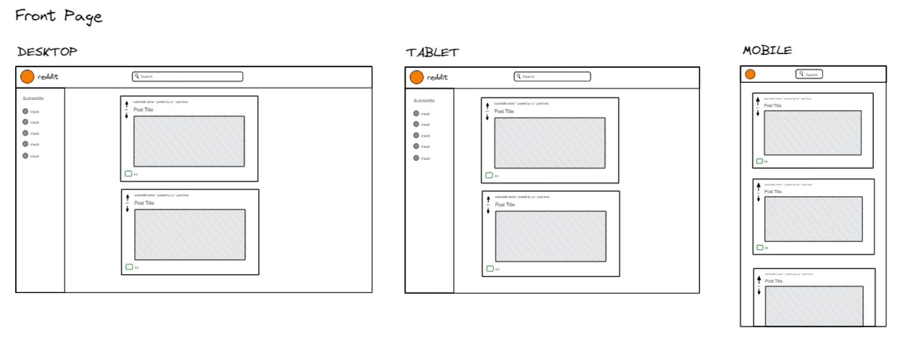
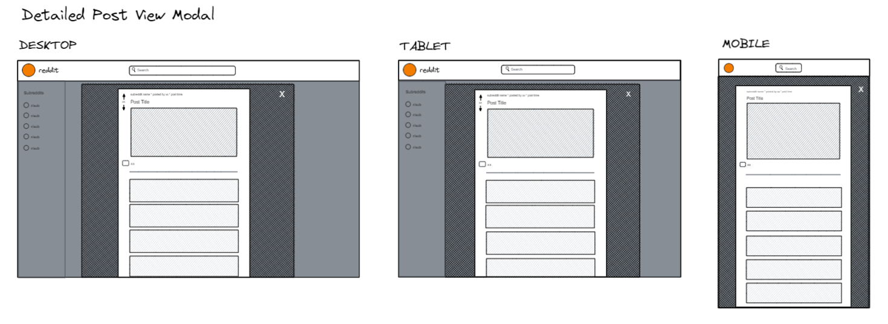
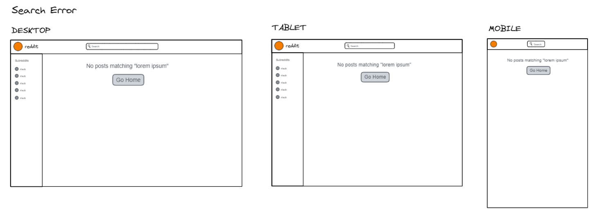

# Reddit Client

**Build Your Own Reddit App**

A portfolio project from Codecademy's Front-End Engineer career path.

## Description

Reddit is a website where people share links to articles, media and other things on the web.

The application integrates data from the Reddit API and allows users to view and search posts and comments provided by the API.

I used the GitHub project management tool, GitHub projects, to plan my work.

## Built With

## Wireframes

## License

Licensed under the MIT license.

## Questions

[Email Me](Chloe.a.harris17@gmail.com) if you have any questions.

Check out more of my work on [GitHub](https://github.com/chloeharris1).
